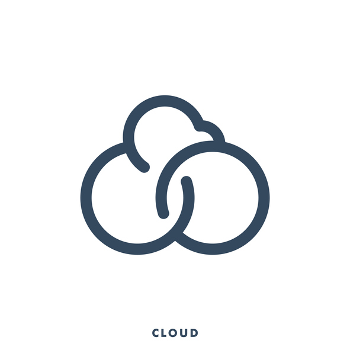

# EnvSync

<p align="center">
  
</p>

<p align="center">
  <a href="https://github.com/zentered/envsync/actions/workflows/test.yml"></a>
  <a href="https://github.com/zentered/envsync/actions/workflows/publish.yml"></a>
  <a href="https://semantic-release.gitbook.io/semantic-release/"></a>
  <a href="https://zentered.co">-Zentered-lightgrey?style=flat"></a>
</p>

`EnvSync` is an attempt to make it easier for developers to initialize an
environment or update environment variables with on a single source of truth.

`EnvSync` currently works with Google Cloud Platform (Secrets Manager). It reads
the environment configuration from an `.env.example` file that is commonly used
to help developers get started with a new project, fetches the values from the
Google Cloud Platform (Secrets Manager) and writes them to a `.env` file.

For example, if you have the following `.env.example` file:

```bash
GCP_PROJECT=myproject-dev
API_URL=http://localhost:3000

AUTH0_CLIENT_SECRET=envsync//auth0-api-client-secret/latest
```

Will write the following `.env` file:

```bash
GCP_PROJECT=myproject-dev
API_URL=http://localhost:3000

AUTH0_CLIENT_SECRET=secret-value-from-gcp-project
```

**Important**: The first variable in the example should be `GCP_PROJECT` as
we're using that to determine the right project. A `keyfile.json`
([Create and manage service account keys](https://cloud.google.com/iam/docs/creating-managing-service-account-keys))
is required in the same folder as the `.env.example` file.

### Installation & Usage

```bash
    npm install @zentered/envsync
    # pnpm i @zentered/envsync
    # yarn add @zentered/envsync
```

#### Two things are required to use `EnvSync`:

1. An `.env.example` file (use `envsync//[variable]` to indicate a variable that
   should be fetched from Secrets Manager). The first variable should be
   `GCP_PROJECT` with the valid project id
2. a `keyfile.json` from a Google Cloud Platform service account with Secrets
   Manager API enabled, and permission to read secrets

`EnvSync` is a CLI tool. You can run it with `npx envsync` or add it as a
`script` in `package.json`:

```json
{
  "scripts": {
    "envsync": "envsync"
  }
}
```

#### Optional: Specifying the `.env` file:

Note: this is an anti-pattern and should be avoided. Environment variables
belong in the environment, not in the codebase. See
[12 factor app](https://12factor.net/config).

- If you have multiple `.env` files, you can provide the filename as an
  argument. The `.env` example file must end in `.example`
- Usage: `npx envsync .env.development.example` will create `.env.development`

## Contributing

See [CONTRIBUTING](CONTRIBUTING.md).

## License

See [LICENSE](LICENSE).
